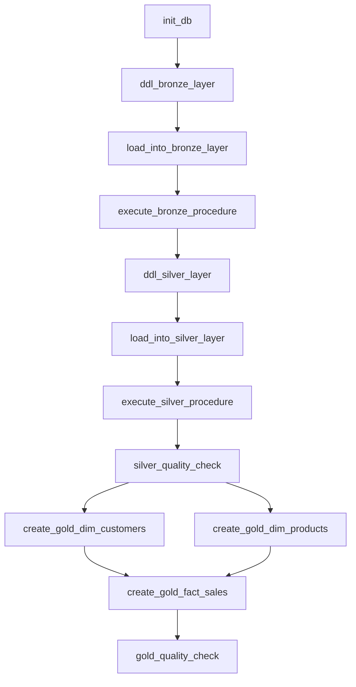

# SQL Data Warehouse Project with Apache Airflow

A comprehensive, production-ready data warehouse solution designed for storing, modeling, and serving clean, analytics-ready data using the **Medallion Architecture** pattern. Now featuring **Apache Airflow** orchestration for automated ETL pipelines and enterprise-grade workflow management.

##  Table of Contents

- [Overview](#overview)
- [🚀 New: Airflow Integration](#-new-airflow-integration)
- [Architecture](#architecture)
- [Project Structure](#project-structure)
- [Data Sources](#data-sources)
- [Getting Started](#getting-started)
- [Database Schema](#database-schema)
- [Airflow ETL Pipeline](#airflow-etl-pipeline)
- [Usage](#usage)
- [Deployment](#deployment)
- [Monitoring & Quality](#monitoring--quality)
- [License](#license)

## Overview

This project implements a modern data warehouse solution using SQL Server, following industry best practices for data ingestion, transformation, and analytics. The warehouse is designed to handle data from multiple source systems (ERP and CRM) and transform it through a three-layer architecture for optimal performance and data quality.

### Key Features

-  **Apache Airflow Orchestration** - Production-ready workflow management
-  **Medallion Architecture** (Bronze → Silver → Gold)
-  **Multi-source Integration** (ERP & CRM systems)
-  **Automated ETL Pipeline** with comprehensive task dependencies
-  **Data Quality Controls** with automated validation checks
-  **Docker Support** for containerized deployment
-  **Parallel Processing** for optimal performance
-  **SQL Server Compatibility** with proper batch handling

## 🚀 New: Airflow Integration

This project now features a complete **Apache Airflow** integration that transforms the traditional SQL-based warehouse into a modern, orchestrated data platform:

### ✨ What's New
- **Complete DAG Implementation** (`dwh_etl_pipeline.py`)
- **Automated Scheduling** with configurable intervals
- **Task Dependencies** with parallel execution where beneficial
- **Error Handling** with comprehensive logging and callbacks
- **Quality Gates** at both Silver and Gold layers
- **Docker Deployment** ready for production environments

### 🔄 Workflow Overview
```
Database Init → Bronze Layer → Silver Layer → Quality Check → Gold Layer → Final Validation
                    ↓              ↓             ↓            ↓
               Raw Data      Cleaned Data    Validated    Analytics Ready
```

### 📊 Gold Layer Architecture
The gold layer is now split into optimized, parallel tasks:
- **Dimension Tables**: `dim_customers` & `dim_products` (parallel execution)
- **Fact Table**: `fact_sales` (depends on dimensions)
- **Quality Validation**: Comprehensive data quality checks


##  Architecture

The data warehouse follows the **Medallion Architecture** pattern, providing a clear separation of concerns and data quality levels:


```
┌─────────────────┐    ┌─────────────────┐    ┌─────────────────┐
│   BRONZE LAYER  │───▶│  SILVER LAYER   │───▶│   GOLD LAYER    │
│                 │    │                 │    │                 │
│ • Raw Data      │    │ • Cleaned Data  │    │ • Analytics     │
│ • As-Is Format  │    │ • Validated     │    │ • Business      │
│ • Source Schema │    │ • Enriched      │    │   Ready         │
└─────────────────┘    └─────────────────┘    └─────────────────┘
```

### Layer Descriptions

| Layer | Purpose | Data Quality | Schema |
|-------|---------|--------------|--------|
| **Bronze** | Raw data ingestion | Source system quality | Source schema |
| **Silver** | Data cleaning & validation | High quality, validated | Optimized schema |
| **Gold** | Business analytics | Production ready | Business schema |

##  Project Structure

```
SQL-Data-Warehouse-Project/
├── 📂 datasets/                    # Source data files
│   ├── 📂 source_erp/             # ERP system data
│   │   ├── PX_CAT_G1V2.csv
│   │   ├── LOC_A101.csv
│   │   └── CUST_AZ12.csv
│   └── 📂 source_crm/             # CRM system data
│       ├── sales_details.csv
│       ├── prd_info.csv
│       └── cust_info.csv
├── 🚀 dags/                       # Apache Airflow DAGs
│   ├── dwh_etl_pipeline.py       # Main ETL pipeline DAG
│   ├── 📂 scripts/               # SQL scripts by layer
│   │   ├── init_DBs.sql          # Database initialization
│   │   ├── 📂 Bronze/            # Raw data layer
│   │   │   ├── ddl_bronze.sql    # Table definitions
│   │   │   └── proc_load_bronze.sql # Data loading procedures
│   │   ├── 📂 Silver/            # Cleaned data layer
│   │   │   ├── ddl_load_silver.sql # Table definitions
│   │   │   └── proc_load_silver.sql # Data transformation procedures
│   │   └── 📂 gold/              # Analytics layer
│   │       ├── create_dim_customers.sql  # Customer dimension
│   │       ├── create_dim_products.sql   # Product dimension
│   │       ├── create_fact_sales.sql     # Sales fact table
│   │       └── ddl_gold.sql             # Legacy gold script
│   └── 📂 test/                  # Data quality tests
│       ├── quality_silver.sql    # Silver layer validation
│       └── quality_gold.sql      # Gold layer validation
├── 🐳 Dockerfile                 # Docker configuration for Airflow
├── requirements.txt              # Python dependencies
├── packages.txt                  # System packages
├── 📂 .astro/                    # Astronomer CLI configuration
├── 📂 docs/                      # Documentation
├── README.md                     
└── LICENSE                       # MIT License
```

##  Data Sources

### CRM System Data
- **Customer Information**: `cust_info.csv` (18,495 records)
- **Product Information**: `prd_info.csv` (399 records)
- **Sales Details**: `sales_details.csv` (3.4MB)

### ERP System Data
- **Customer Data**: `CUST_AZ12.csv` (18,485 records)
- **Location Data**: `LOC_A101.csv` (18,486 records)  
- **Product Categories**: `PX_CAT_G1V2.csv` (38 records)

##  Getting Started

### Prerequisites

**For Traditional SQL Deployment:**
- SQL Server 2019 or later
- SQL Server Management Studio (SSMS)
- Git (for version control)

**For Airflow Deployment (Recommended):**
- Docker & Docker Compose
- Python 3.8+
- Apache Airflow 2.5+
- SQL Server connection configured in Airflow
- Astronomer CLI (optional, for easier deployment)

### Installation

#### Option 1: Airflow Deployment (Recommended)

1. **Clone the repository**
   ```bash
   git clone https://github.com/omarabdullatiff/SQL-Data-Warehouse-Project.git
   cd SQL-Data-Warehouse-Project
   ```

2. **Set up Airflow with Docker**
   ```bash
   # Using Astronomer CLI (recommended)
   astro dev start
   
   # Or using Docker Compose
   docker-compose up -d
   ```

3. **Configure SQL Server Connection**
   - Access Airflow UI at `http://localhost:8080`
   - Go to Admin → Connections
   - Create connection with ID: `sql_server_dwh_conn`
   - Configure your SQL Server details

4. **Trigger the DAG**
   - Navigate to DAGs in Airflow UI
   - Find `dwh_etl_pipeline`
   - Click "Trigger DAG" to run the complete pipeline

#### Option 2: Traditional SQL Deployment

1. **Clone and setup database**
   ```bash
   git clone https://github.com/omarabdullatiff/SQL-Data-Warehouse-Project.git
   cd SQL-Data-Warehouse-Project
   ```

2. **Initialize the database**
   ```sql
   -- Run the initialization script
   sqlcmd -S your_server -i dags/scripts/init_DBs.sql
   ```

3. **Set up the layers manually**
   ```sql
   -- Create Bronze tables
   sqlcmd -S your_server -d datawarehouse -i dags/scripts/Bronze/ddl_bronze.sql
   
   -- Create Silver tables  
   sqlcmd -S your_server -d datawarehouse -i dags/scripts/Silver/ddl_load_silver.sql
   ```

##  Database Schema

### Bronze Layer Tables

| Table | Purpose | Source |
|-------|---------|--------|
| `bronze.crm_cust_info` | Raw customer data | CRM system |
| `bronze.crm_prd_info` | Raw product data | CRM system |
| `bronze.erp_cust_info` | Raw customer data | ERP system |
| `bronze.erp_loc_info` | Raw location data | ERP system |

### Silver Layer Tables

| Table | Purpose | Enhancements |
|-------|---------|-------------|
| `silver.crm_cust_info` | Cleaned customer data | + Data validation, + Metadata |
| `silver.crm_prd_info` | Cleaned product data | + Data validation, + Metadata |
| `silver.erp_cust_info` | Cleaned customer data | + Data validation, + Metadata |
| `silver.erp_loc_info` | Cleaned location data | + Data validation, + Metadata |

### Gold Layer Views (New!)

| View | Purpose | Business Value |
|------|---------|----------------|
| `gold.dim_customers` | Customer dimension | 360° customer view with demographics |
| `gold.dim_products` | Product dimension | Complete product catalog with categories |
| `gold.fact_sales` | Sales fact table | Analytics-ready sales transactions |

## Airflow ETL Pipeline

The complete ETL pipeline is now orchestrated through Apache Airflow with the following workflow:

### 🔄 Pipeline Architecture



### 📋 Task Breakdown

| Task | Purpose | Layer | Execution |
|------|---------|-------|-----------|
| `init_db` | Initialize database schemas | Setup | Sequential |
| `ddl_bronze_layer` | Create Bronze tables | Bronze | Sequential |
| `load_into_bronze_layer` | Load raw data procedures | Bronze | Sequential |
| `execute_bronze_procedure` | Execute data loading | Bronze | Sequential |
| `ddl_silver_layer` | Create Silver tables | Silver | Sequential |
| `load_into_silver_layer` | Load transformation procedures | Silver | Sequential |
| `execute_silver_procedure` | Execute transformations | Silver | Sequential |
| `silver_quality_check` | Validate Silver data quality | Silver | Sequential |
| `create_gold_dim_customers` | Create customer dimension | Gold | **Parallel** |
| `create_gold_dim_products` | Create product dimension | Gold | **Parallel** |
| `create_gold_fact_sales` | Create sales fact table | Gold | Sequential |
| `gold_quality_check` | Final data validation | Gold | Sequential |

### ⚙️ Configuration

- **Schedule**: Daily at 12:00 PM (`0 12 * * *`)
- **Max Active Runs**: 1 (prevents overlapping executions)
- **Catchup**: Disabled
- **SQL Server Connection**: `sql_server_dwh_conn`
- **Split Statements**: Enabled for proper SQL Server batch handling

## 💻 Usage

### With Airflow (Recommended)

1. **Access Airflow UI**:
   ```bash
   # Navigate to Airflow dashboard
   http://localhost:8080
   ```

2. **Run Complete Pipeline**:
   - Go to DAGs → `dwh_etl_pipeline`
   - Click "Trigger DAG" for full execution
   - Monitor progress in real-time

3. **Manual Task Execution**:
   - Click on individual tasks to run specific steps
   - View logs and troubleshoot issues
   - Retry failed tasks as needed

### Traditional SQL Usage

1. **Load Bronze data**:
   ```sql
   USE datawarehouse;
   EXEC bronze.proc_load_bronze;
   ```

2. **Transform to Silver**:
   ```sql
   USE datawarehouse;
   EXEC silver.proc_load_silver;
   ```

### Querying Analytics Data

```sql
-- Customer Analytics from Gold Layer
SELECT 
    customer_id,
    first_name,
    last_name,
    country,
    gender,
    create_date
FROM gold.dim_customers
WHERE create_date >= '2023-01-01';

-- Sales Analytics with Dimensions
SELECT 
    c.first_name + ' ' + c.last_name as customer_name,
    p.product_name,
    p.category,
    f.sales_amount,
    f.quantity,
    f.order_date
FROM gold.fact_sales f
JOIN gold.dim_customers c ON f.customer_key = c.customer_key
JOIN gold.dim_products p ON f.product_key = p.product_key
WHERE f.order_date >= '2023-01-01'
ORDER BY f.sales_amount DESC;
```

## Deployment

### 🐳 Docker Deployment

The project includes a complete Docker setup for production deployment:

```bash
# Build and start Airflow
docker-compose up -d

# Check container status
docker-compose ps

# View logs
docker-compose logs -f webserver
```

### ☁️ Cloud Deployment

**Astronomer (Recommended)**:
```bash
# Initialize Astronomer project
astro dev init

# Deploy to Astronomer Cloud
astro deploy
```

**Manual Deployment**:
- Configure SQL Server connection in production
- Set up environment variables for security
- Configure monitoring and alerting

## Monitoring & Quality

### 📊 Data Quality Checks

The pipeline includes automated quality validation:

- **Silver Layer Validation**: `test/quality_silver.sql`
  - Data completeness checks
  - Referential integrity validation
  - Duplicate detection

- **Gold Layer Validation**: `test/quality_gold.sql`
  - Dimension table uniqueness
  - Fact table consistency
  - Business rule validation

### 🔍 Airflow Monitoring

- **Task Duration**: Monitor execution times
- **Success Rate**: Track pipeline reliability  
- **Data Freshness**: Verify latest data loads
- **Error Alerting**: Automated failure notifications

### 📈 Key Metrics

- Pipeline execution time: ~15-30 minutes
- Data quality score: >95% target
- System availability: 99.9% uptime
- Error rate: <1% of total runs

### 🛠️ Troubleshooting

Common issues and solutions:

1. **SQL Server Connection Issues**:
   ```bash
   # Test connection in Airflow
   airflow connections test sql_server_dwh_conn
   ```

2. **Task Failures**:
   - Check Airflow logs for detailed error messages
   - Verify SQL Server permissions
   - Ensure data sources are accessible

3. **Performance Issues**:
   - Monitor SQL Server resource usage
   - Optimize query execution plans
   - Consider parallel processing adjustments

## 📄 License

This project is licensed under the MIT License - see the [LICENSE](LICENSE) file for details.

##  Acknowledgments

- **Apache Airflow Community** for the excellent orchestration platform
- **SQL Server Community** for best practices and optimization techniques  
- **Astronomer** for Docker and deployment tools
- **Data Engineering Community** for medallion architecture patterns

---

## 🚀 What's Next?

Future enhancements planned:
- **dbt Integration** for advanced transformations
- **Great Expectations** for enhanced data quality
- **Kubernetes Deployment** for scalable production
- **Real-time Streaming** with Apache Kafka
- **Data Lineage Tracking** with OpenLineage

---

**Ready to modernize your data warehouse?** Start with Airflow orchestration today! 🎯
